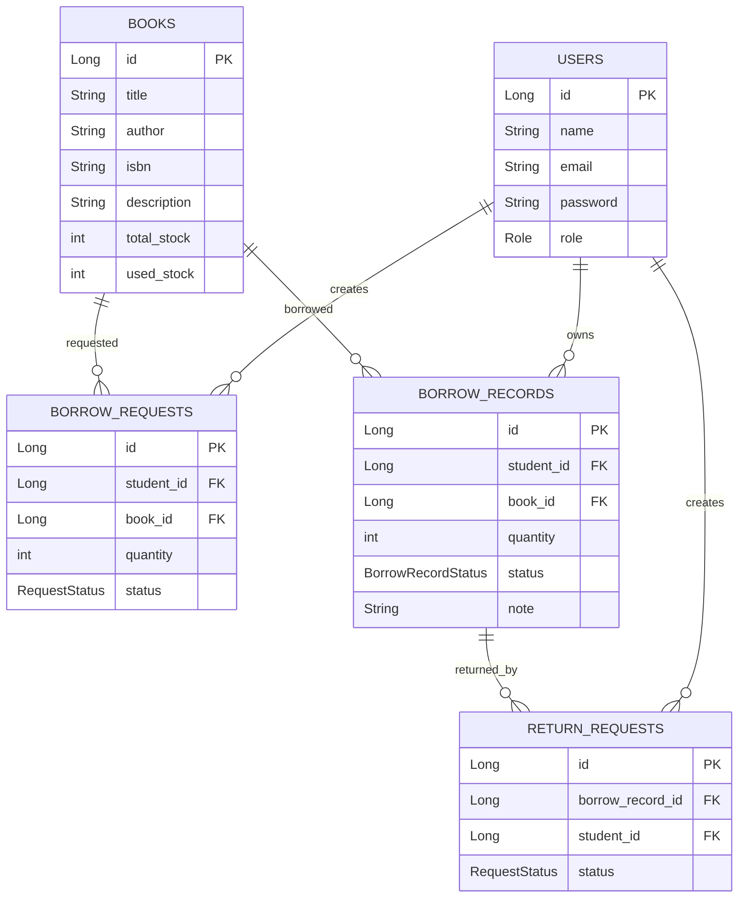

# Architecture Documentation

## Architecture

The application follows a layered architecture.

```text
Controller Layer
    ↓
Service Layer
    ↓
Repository Layer
    ↓
Database
```

## Entity Relationship Diagram



## Borrow Workflow

```text
Student
↓
Borrow Request (PENDING)
↓
Admin Approval
↓
Borrow Record Created
↓
Book usedStock Increased
```

## Return Workflow

```text
Student
↓
Return Request (PENDING)
↓
Admin Approval
↓
Borrow Record Returned
↓
Book usedStock Decreased
```

## Main Entities

### User

Represents a system user with either STUDENT or ADMIN role.

### Book

Represents a book and its stock information.

### BorrowRequest

Stores requests waiting for administrator approval.

### BorrowRecord

Represents books currently borrowed or previously returned.

### ReturnRequest

Stores requests waiting for administrator approval before books are returned.

## API Endpoints

### Users

* POST `/api/users`
* GET `/api/users`
* GET `/api/users/{id}`
* POST `/api/users/login`

### Books

* GET `/api/books`
* GET `/api/books/{id}`
* POST `/api/books`
* PUT `/api/books/{id}`
* DELETE `/api/books/{id}`

### Borrow Requests

* GET `/api/borrow-requests`
* GET `/api/borrow-requests/student/{studentId}`
* POST `/api/borrow-requests`
* PUT `/api/borrow-requests/{id}/approve`
* PUT `/api/borrow-requests/{id}/reject`

### Borrow Records

* GET `/api/borrow-records/student/{studentId}`

### Return Requests

* GET `/api/return-requests`
* POST `/api/return-requests`
* PUT `/api/return-requests/{id}/approve`
* PUT `/api/return-requests/{id}/reject`

# Folder Structure
## Project Structure

```text
library-management-system/
├── library-system/
│   ├── src/main/java/com/leslie/library_system/
│   │   ├── controller/
│   │   │   ├── BookController.java
│   │   │   ├── UserController.java
│   │   │   ├── BorrowRequestController.java
│   │   │   ├── BorrowRecordController.java
│   │   │   └── ReturnRequestController.java
│   │   │
│   │   ├── services/
│   │   │   ├── BookService.java
│   │   │   ├── UserService.java
│   │   │   ├── BorrowRequestService.java
│   │   │   ├── BorrowRecordService.java
│   │   │   └── ReturnRequestService.java
│   │   │
│   │   ├── repository/
│   │   │   ├── BookRepository.java
│   │   │   ├── UserRepository.java
│   │   │   ├── BorrowRequestRepository.java
│   │   │   ├── BorrowRecordRepository.java
│   │   │   └── ReturnRequestRepository.java
│   │   │
│   │   ├── model/
│   │   │   ├── Book.java
│   │   │   ├── User.java
│   │   │   ├── BorrowRequest.java
│   │   │   ├── BorrowRecord.java
│   │   │   └── ReturnRequest.java
│   │   │
│   │   ├── dto/
│   │   │   ├── book/
│   │   │   ├── user/
│   │   │   ├── borrowrequest/
│   │   │   ├── borrowrecord/
│   │   │   └── returnrequest/
│   │   │
│   │   ├── exception/
│   │   │
│   │   └── LibrarySystemApplication.java
│   │
│   └── src/main/resources/
│       └── application.properties
│
├── library-system-ui/
│   └── src/
│       ├── api/
│       │
│       └── pages/
│           ├── LoginPage.jsx
│           ├── StudentPortal.jsx
│           ├── AdminPortal.jsx
│           ├── BooksPage.jsx
│           └── UsersPage.jsx
└── docs/
    ├── readme.md
    ├── architecture.md
    └── setup.md
```

### Backend Package Responsibilities

| Package    | Responsibility                                                                      |
| ---------- | ------------------------------------------------------------------------------------|
| controller | Handle HTTP requests and responses                                                  |
| services   | Contain business logic                                                              |
| repository | Access database using Spring Data JPA                                               |
| model      | JPA entity classes                                                                  |
| dto        | Request and response objects (for hiding some data from the user)                   |
| exception  | Custom exceptions and global exception handling                                     |

